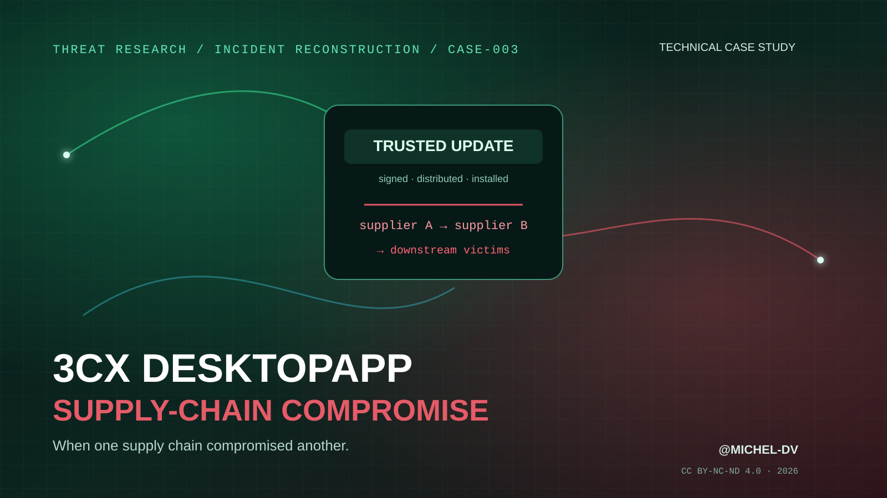

<div align="center">
  

# 3CX DesktopApp Supply-Chain Compromise

### Technical Case Study — When One Supply Chain Compromised Another

**Trust propagated the intrusion.**

[](#)
[](https://github.com/Michel-DV/3cx-desktopapp-supply-chain-case-study/releases/tag/v1.0.0)
[](report/3CX_DesktopApp_Supply_Chain_Case_Study_Michel-DV.pdf)
[](LICENSE)
[](https://github.com/Michel-DV)

</div>

---

## Overview

**CASE-003** reconstructs the 2023 compromise of the 3CX DesktopApp distribution chain, tracked as **CVE-2023-29059**.

The defining feature of the incident is not simply that signed software was trojanized. Mandiant traced the compromise of 3CX back to a **previous software-supply-chain compromise** involving Trading Technologies' X_TRADER package. Access to a 3CX employee's personal endpoint was converted into corporate VPN access, internal lateral movement, compromise of Windows and macOS build environments, and finally malicious 3CX releases delivered to downstream customers.

The report therefore treats 3CX as a **cascading supply-chain incident** — a chain in which one trusted supplier became the access path into another.

> **Core lesson:** a software signature can prove who released an artifact while saying nothing about whether the release process itself was already under attacker control.

## Read the report

**[Open the report in the repository →](report/3CX_DesktopApp_Supply_Chain_Case_Study_Michel-DV.pdf)**  
**[Download the v1.0.0 release asset →](https://github.com/Michel-DV/3cx-desktopapp-supply-chain-case-study/releases/download/v1.0.0/3CX_DesktopApp_Supply_Chain_Case_Study_Michel-DV.pdf)**

Integrity check: [`report/SHA256SUMS.txt`](report/SHA256SUMS.txt)

## Attack chain at a glance

```text
Trojanized X_TRADER
        ↓
3CX employee personal endpoint
        ↓
Corporate credentials / VPN access
        ↓
Credential harvesting + lateral movement
        ↓
Windows + macOS build environments
        ↓
Signed trojanized 3CX DesktopApp releases
        ↓
Customer endpoints execute trusted update
        ↓
ICONIC / UpdateAgent reconnaissance
        ↓
Selective follow-on targeting
```

## Key findings

| Finding | Why it matters |
|---|---|
| **The incident was a cascading supply-chain compromise** | A first compromised vendor created the access path into a second vendor's build and release process. |
| **Valid corporate credentials crossed the boundary from a personal device** | Endpoint ownership and identity trust were not equivalent security boundaries. |
| **Both Windows and macOS build environments were compromised** | The actor invested in preserving a cross-platform downstream delivery capability. |
| **Signed releases carried malicious components** | Code-signing reputation could not distinguish a legitimate build from a malicious build produced inside the trusted environment. |
| **Public GitHub content was used as routing infrastructure** | Benign web services can provide low-friction C2 discovery and configuration. |
| **Broad exposure was followed by selective targeting** | Affected software presence is not equivalent to targeted second-stage compromise. |
| **Behavioral detections contradicted static trust** | EDR and network behavior surfaced the incident despite legitimate vendor and signing signals. |

## What the report covers

1. Incident profile and confidence model
2. Strategic value of 3CX as a downstream supplier
3. 2022–2023 incident timeline
4. Cascading supply-chain attack model
5. X_TRADER / VEILEDSIGNAL initial-access chain
6. Corporate VPN entry and internal movement
7. Windows build-host compromise: TAXHAUL / COLDCAT
8. macOS build-host compromise: POOLRAT
9. Windows malicious DesktopApp execution chain
10. GitHub ICO dead-drop / C2-routing mechanism
11. ICONICSTEALER reconnaissance and victim selection
12. macOS libffmpeg.dylib / UpdateAgent path
13. Discovery through behavioral endpoint detections
14. Exposure vs successful exploitation
15. UNC4736 / North Korea nexus with confidence boundaries
16. Containment, rebuild and trust restoration
17. Representative MITRE ATT&CK mapping
18. **Original trust-boundary reconstruction**
19. **Detection hypotheses and control blueprint**
20. **Safe Red Team / research emulation notes**
21. Lessons, myths and primary evidence trail

## Original analysis layer

This publication intentionally goes beyond an incident summary.

### Trust-boundary reconstruction

The report follows seven trust conversions:

`vendor download → personal endpoint → corporate identity → internal network → build environment → signed release → customer runtime`

For each conversion it identifies both the attacker's leverage and a defensive choke point.

### Detection hypotheses

The analysis turns the incident into testable hypotheses around:

- corporate VPN use from newly risky or unmanaged endpoints
- service-level persistence on production build hosts
- release artifacts that diverge from approved component provenance
- trusted DesktopApp processes retrieving image-based routing material
- signer reputation contradicting runtime behavior
- broad first-stage execution followed by rare targeted payload delivery

### Red Team / research notes

The emulation section focuses on **safe trust-path validation**: benign library substitution, lab-only side-loading, test release signing, staged downstream markers, provenance controls and build-host canaries. It explicitly avoids distributing a real supply-chain backdoor or credential-stealing payload.

## Important distinctions

- **Electron was not the root cause.** The vendor environment and release process were compromised.
- **An affected DesktopApp build does not prove hands-on-keyboard access.** Later stages were selective.
- **Code signing did not fail cryptographically.** The malicious artifact inherited legitimate trust from the compromised release process.
- **The 3CX intrusion did not begin at 3CX.** Mandiant traced it back to the earlier X_TRADER supply-chain compromise.
- **Attribution labels are not interchangeable.** UNC4736, AppleJeus, LABYRINTH CHOLLIMA and public “Lazarus” terminology come from different tracking systems and confidence models.

## Defensive themes

- device-bound, phishing-resistant access for corporate VPN and privileged identities
- dedicated build enclaves with privileged-access controls
- behavioral EDR on signing and build infrastructure
- reproducible artifact generation and independent provenance attestation
- two-person release approval
- runtime behavior analytics capable of overruling signer reputation
- staged update rings with anomaly monitoring
- exposure tiering from affected artifact to confirmed targeted follow-on activity

## Reproducible publication

The PDF is generated from version-controlled HTML/CSS by `.github/workflows/publish-report.yml`.

The workflow renders the dedicated cover and body separately, merges them, validates page count, calculates SHA-256, commits the generated publication using the `Michel-DV` author identity, and publishes the release asset.

## Methodology

Primary incident-response and vendor evidence is prioritized. Claims that evolved during the investigation are resolved in favor of later forensic findings. Attribution is retained with source confidence language.

See [`docs/METHODOLOGY.md`](docs/METHODOLOGY.md) and [`docs/REFERENCES.md`](docs/REFERENCES.md).

## Repository structure

```text
.
├── .github/workflows/
│   └── publish-report.yml
├── assets/
│   └── cover-mobile-safe.svg
├── docs/
│   ├── METHODOLOGY.md
│   └── REFERENCES.md
├── report/
│   ├── cover.html
│   ├── source.html
│   ├── 3CX_DesktopApp_Supply_Chain_Case_Study_Michel-DV.pdf
│   └── SHA256SUMS.txt
├── CHANGELOG.md
├── CITATION.cff
├── DISCLAIMER.md
├── RELEASE_NOTES.md
├── LICENSE
└── README.md
```

## Threat Case Studies series

- **CASE-001 — SolarWinds Supply-Chain Compromise**
- **CASE-002 — XZ Utils Backdoor (CVE-2024-3094)**
- **CASE-003 — 3CX DesktopApp Supply-Chain Compromise** ← this publication

## Citation

If this case study is useful in research, training, coursework or internal documentation, cite the repository or use [`CITATION.cff`](CITATION.cff).

**Author:** [@Michel-DV](https://github.com/Michel-DV)  
**Series:** Michel-DV Threat Case Studies — CASE-003  
**Release:** v1.0.0  
**Year:** 2026

## License

© 2026 **Michel-DV**.

This publication is licensed under **Creative Commons Attribution-NonCommercial-NoDerivatives 4.0 International (CC BY-NC-ND 4.0)**.

## Disclaimer

This is an independent technical study based on publicly available information. It is not affiliated with or endorsed by 3CX, Mandiant / Google, Trading Technologies, CISA, SentinelOne, Volexity, CrowdStrike, MITRE, or other referenced organizations.

---

<div align="center">

**The attacker did not merely poison an update. They turned one trusted supplier into the path for compromising another.**

[@Michel-DV](https://github.com/Michel-DV)

</div>
